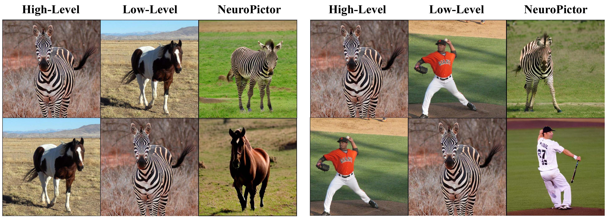
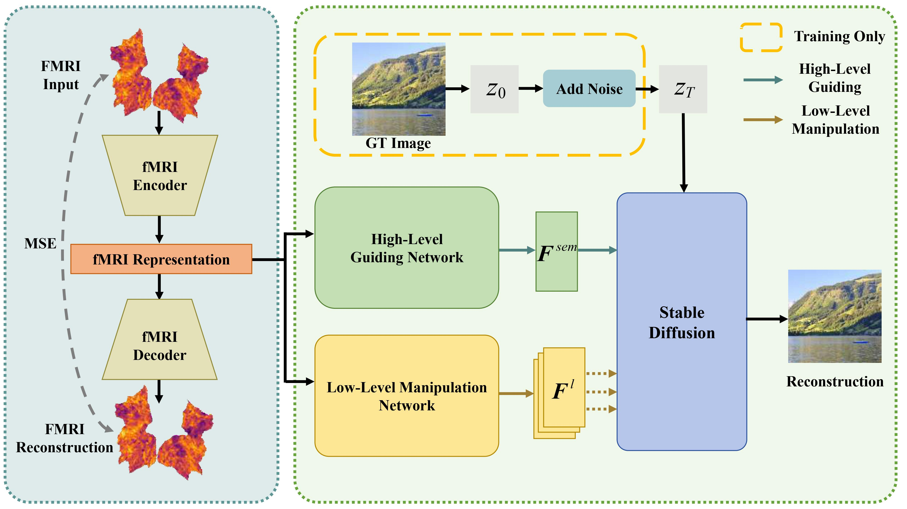

# NeuroPictor

<!-- <div align="left">
  <a href="https://jingyanghuo.github.io/neuropictor/"></a> 
  <a href="https://arxiv.org/abs/2403.18211"></a> 
  <a href="https://huggingface.co/Fudan-fMRI/neuropictor"></a>
</div> -->


This is the official PyTorch implementation of the paper:
[**"NeuroPictor: Refining fMRI-to-Image Reconstruction via Multi-individual Pretraining and Multi-level Modulation"**<br>](https://arxiv.org/abs/2403.18211)

[**Project Page**](https://jingyanghuo.github.io/neuropictor/), 
[**Paper**](https://arxiv.org/abs/2403.18211)

<div style="text-align: center;">
  
</div>


## Abstract
<div style="text-align: center;">
  
</div>
Recent fMRI-to-image approaches mainly focused on associating fMRI signals with specific conditions of pre-trained diffusion models.
These approaches, while producing high-quality images, capture only a limited aspect of the complex information in fMRI signals and offer little detailed control over image creation.
In contrast, this paper proposes to directly modulate the generation process of diffusion models using fMRI signals. 
Our approach, NeuroPictor, divides the fMRI-to-image process into three steps: 
i) fMRI calibrated-encoding, to tackle multi-individual pre-training for a shared latent space to minimize individual difference and enable the subsequent multi-subject training; 
ii) fMRI-to-image multi-subject pre-training, perceptually learning to guide diffusion model with high- and low-level conditions across different individuals;
iii) fMRI-to-image single-subject refining, similar with step ii but focus on adapting to particular individual. 
NeuroPictor extracts high-level semantic features from fMRI signals that characterizing the visual stimulus and incrementally fine-tunes the diffusion model with a low-level manipulation network to provide precise structural instructions. 
By training with about 67,000 fMRI-image pairs from various individuals, our model enjoys superior fMRI-to-image decoding capacity, particularly in the within-subject setting, as evidenced in benchmark datasets.


## Installation

Download this repository and create the environment:
```
git clone https://github.com/jingyanghuo/neuropictor.git
cd neuropictor
conda env create -f env.yaml
conda activate neuropictor
```

## Quick Start

1. **Download the Demo Dataset**

   To quickly infer using our model, we provide a [demo dataset](https://huggingface.co/Fudan-fMRI/neuropictor/blob/main/demo_data.zip) (~47 MB).  Download and then unzip it:

   ```bash
   cd example
   unzip demo_data.zip
   cd ..
   ```

2. **Download the Checkpoint**

   Download the corresponding [checkpoint](https://huggingface.co/Fudan-fMRI/neuropictor/tree/main/ckpt/NSD/finetune_single_sub/sub01) for subject-1 and place it in the following directory:

   ```bash
   ./ckpt/NSD/finetune_single_sub/sub01/epoch_015.pth
   ```

3. **Download the Encoder**

   Download the [encoder](https://huggingface.co/Fudan-fMRI/neuropictor/tree/main/ckpt/fMRI2fMRI_UKB) and place it in the following directory:

   ```bash
   ./ckpt/fMRI2fMRI_UKB
   ```

4. **Reconstruct Images**

   Reconstruct images by running the following command:

   ```bash
   python demo.py
   ```

   This process takes about 5 minutes to reconstruct 100 examples. The results will be saved in `./example/demo_results`.


## Data Preparation

Before using the NSD (Natural Scenes Dataset) data, please read and agree to the [terms and conditions](https://cvnlab.slite.page/p/IB6BSeW_7o/Terms-and-Conditions) of the Natural Scenes Dataset and complete the [NSD Data Access Agreement](https://forms.gle/xue2bCdM9LaFNMeb7).

Download the complete preprocessed data and models from [Hugging Face](https://huggingface.co/Fudan-fMRI/neuropictor/tree/main) (~100 GB). You will need to unzip `NSD/nsddata_stimuli.zip` and `NSD/fmri_npy.zip`. Your directory tree should look like this:

```
${ROOT}
|-- NSD
    |-- fmri_npy
    |   |-- 01_norm
    |   |   |-- surf_000000.npy  
    |   |   |-- surf_000001.npy
    |   |   |-- ...
    |   |-- 02_norm
    |   |   |-- surf_000000.npy
    |   |   |-- surf_000001.npy
    |   |   |-- ...
    |   |-- ...
    |   |   |-- ...
    |   |-- 01_label.npy
    |   |-- 02_label.npy
    |   |-- ...
    |-- nsddata_stimuli
    |   |-- stimuli
    |   |   |-- images
    |   |   |   |-- image_000000.png
    |   |   |   |-- image_000001.png
    |   |   |   |-- ...
    |-- COCO_73k_annots_curated.npy
    |-- sub1257_shared_triallabel.npy
    |-- unique_triallabel.npy
    |-- vc_roi.npz

|-- ckpt
    |-- fMRI2fMRI_UKB
    |   |-- checkpoint_120000.pth
    |   |-- fMRI_AutoEncoder.yaml
    |-- SD21
    |   |-- control_sd21_ini.ckpt
    |-- NSD
    |   |-- pretrain_multi_sub
    |   |   |-- sub_all_womask
    |   |   |-- sub_all_mask
    |   |-- finetune_single_sub
    |   |   |-- sub01
    |   |   |-- sub02
    |   |   |-- sub05
    |   |   |-- sub07
```


## Train

### Multi-subject Pre-training

1. Perform fMRI-to-image multi-subject pre-training from scratch using data from subjects 1-8 of NSD. Train the model with default parameters:

```bash
python train.py --config_path ./models/pretrain.yaml
```

2. (Optional) Optionally, adapt the model to Classifier-Free Guidance by randomly replacing 5% of the semantic features with unconditional CLIP embeddings corresponding to empty characters `['']`. This process can enhance the performance of the multi-subject pre-training model but show little impact on single-subject finetuning afterward. You can choose to skip this step.

```bash
python train.py --config_path ./models/pretrain_mask.yaml
```

### Single-subject Finetuning

1. Finetune the pre-trained model on a specific subject by running:

```bash
python train.py --config_path ./models/finetune.yaml
```

The default configuration is set for subject-1 with our pretrained multi-subject model. Modify `train_subs` and `val_subs` in `./models/finetune.yaml` for training on other subjects. For subject-1, 160 epochs are enough with default parameters. For subjects 2, 5, and 7, set the max epoch to 180-200 is better. Refer to the comments in `./models/finetune.yaml` for details on other parameters.

2. Adapt the finetuned model to Classifier-Free Guidance by randomly replacing 5% of the semantic features with unconditional CLIP embeddings corresponding to empty characters `['']`. Modify `checkpoint_path` in `./models/finetune_mask.yaml` to load the finetuned single-subject model from the last step and run:

```bash
python train.py --config_path ./models/finetune_mask.yaml
``` 

## fMRI-to-image Reconstruction

You can directly use our provided checkpoint for fMRI-to-image reconstruction or modify the ckpt path to a new location. Simply run:

```bash
python reconstruction.py --ckpt ckpt/NSD/finetune_single_sub/sub01/epoch_015.pth --test_sub 1 --n_samples 1
```

By default, this process takes about 40-50 minutes.

<div style="text-align: center;">
  
</div>


To evaluate the reconstructions, modify the argument ``root_dir`` to the path where the images are saved from the reconstruction step and run:

```bash
python eval_metrics.py --root_dir ./infer_results/finetune_single_sub/sub1_epoch_015_ucond_scale5.0
```

## Citation
If you find our work useful to your research, please consider citing: 
```
@article{huo2024neuropictor,
  title={NeuroPictor: Refining fMRI-to-Image Reconstruction via Multi-individual Pretraining and Multi-level Modulation},
  author={Huo, Jingyang and Wang, Yikai and Qian, Xuelin and Wang, Yun and Li, Chong and Feng, Jianfeng and Fu, Yanwei},
  journal={arXiv preprint arXiv:2403.18211},
  year={2024}
}
```

## Acknowledgement
This project is built on [ControlNet](https://github.com/lllyasviel/ControlNet). Evaluation code is adapted from [MindEye](https://github.com/MedARC-AI/fMRI-reconstruction-NSD). Thanks for their excellent work.